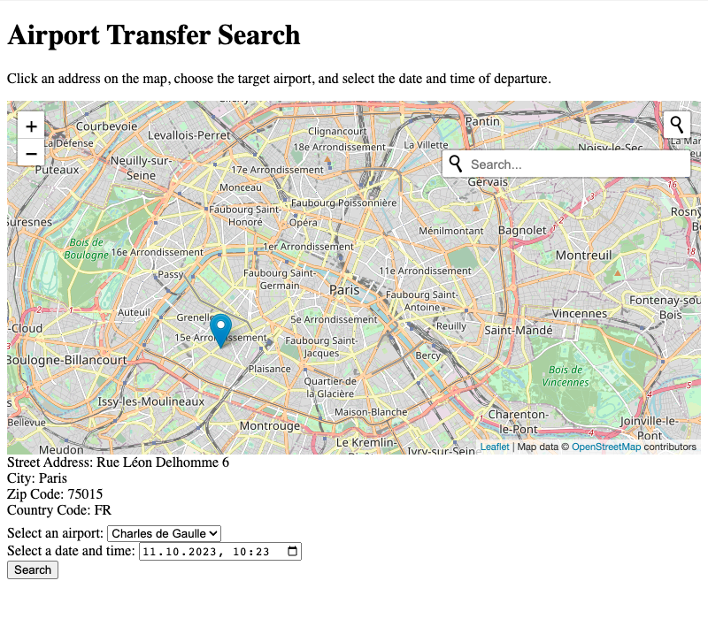

# Airport Transfer Demo



## About this app

This web app demonstrates the use of the Amadeus Transfer Search API and the Amadeus Transfer Booking API. It was created for the article "Building an Airport Transfer App with Go and Amadeus for Developers". 

## Prerequisites for running the app

[Sign up](https://developers.amadeus.com/register) for a free developer account and follow the steps in the [documentation](https://developers.amadeus.com/get-started/get-started-with-self-service-apis-335) to generate an API key and secret.

You need both in order to run the app (see below). The app needs the key and the secret to generate and refresh ephemeral access tokens. 

## How to run the app

You can run the demo app in a few easy steps.

1. Clone this repository.
2. `cd` into the repository.
3. Add the API key and secret as environment variables. For example, on Unix-like systems:
	```sh
	export AMADEUS_CLIENT_ID=...
	export AMADEUS_CLIENT_SECRET=...
	```

4. Execute `go run .`
5. Open the browser and navigate to http://localhost:8020.

## What can I do in this app?

This app allows you to search for an airport transfer and simulate a booking. The article covers all details, but here are the key steps:

1. The start screen shows a map of Paris. Click on the map to select a start location (or use the search bar to enter an address). 
2. Select an airport, and the desired start date and time. (Or use the default values.)
3. Click on the "Search" button. The app will call the Amadeus Transfer Search API and display a list of available transfers. Each transfer offer has a "Book this transfer" button. 
4. Click this button to invoke the Amadeus Transfer Booking API. The app will call the Amadeus Transfer Booking API and display a booking confirmation. 
